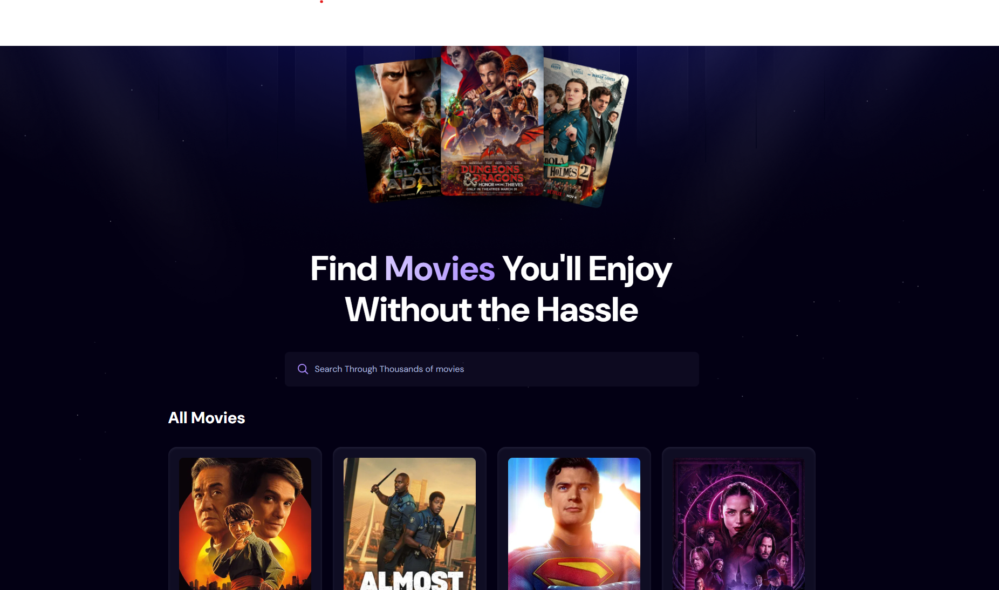

# 🎬 Movie Explorer App

A fast and elegant movie search application built with [Vite](https://vitejs.dev/), powered by [The Movie DB API](https://www.themoviedb.org/documentation/api). This app allows users to search for movies in real-time, view key movie details, and explore trending titles with a smooth and intuitive interface.

 <!-- Replace with your actual screenshot path -->

## 🚀 Features

- 🔍 **Optimized Live Search** – Type instantly and get accurate, fast search results using The Movie DB's API.
- 💡 **Trending Movies** – Browse trending movies with poster previews, ratings, and release dates.
- 🖼️ **Clean and Responsive UI** – Built with modern design principles, responsive across all devices.
- ⚡ **Vite-Powered Performance** – Ultra-fast development and build performance with Vite.
- 🧠 **Debounced Search** – Reduces unnecessary API calls by intelligently handling user input.
- 📦 **Modular Codebase** – Clean component structure for easy scalability and maintenance.

## 🛠️ Tech Stack

- **Frontend**: React, Vite
- **API**: The Movie DB (TMDb)
- **Styling**: CSS Modules / TailwindCSS (edit based on your choice)
- **State Management**: React Hooks (`useState`, `useEffect`)

## 📷 Demo

👉 [Live Demo](https://your-demo-link.com) _(replace this with your Netlify or Vercel link)_

## 🔧 Getting Started

1. **Clone the repo**

   ```bash
   git clone https://github.com/your-username/movie-app.git
   cd movie-app
   ```

2. **Install dependencies**

   ```bash
   npm install
   ```

3. **Create a `.env` file** in the root folder with your API key:

   ```env
   VITE_TMDB_API_KEY=your_tmdb_api_key
   ```

4. **Run the development server**

   ```bash
   npm run dev
   ```

5. Open [http://localhost:5173](http://localhost:5173) to see it in action.

## 🗂️ Folder Structure

```
src/
├── components/
│   ├── MovieCard.jsx
│   ├── SearchBar.jsx
│   └── ...
├── pages/
│   └── Home.jsx
├── api/
│   └── tmdb.js
├── App.jsx
├── main.jsx
└── styles/
    └── ...
```

## 📌 Roadmap / Possible Enhancements

- [ ] Add pagination and infinite scrolling
- [ ] Movie details page with trailers, cast, and reviews
- [ ] Dark mode toggle
- [ ] Genre-based filtering
- [ ] Save favorites to localStorage

## 🤝 Acknowledgements

- [The Movie Database (TMDb)](https://www.themoviedb.org/) for their amazing free movie API.
- [Vite](https://vitejs.dev/) for lightning-fast frontend tooling.
- [React](https://reactjs.org/) for the flexible UI framework.

## 🧑‍💻 Author

**Zalmai Zazai**  
📫 [zazaizalmai70@gmail.com](mailto:zazaizalmai70@gmail.com)  
🌐 [Portfolio](https://zalmai-zazai.github.io/ProtFolioApp/) | [GitHub](https://github.com/zalmai-zazai) | [LinkedIn](https://www.linkedin.com/in/zalmai-zazai-541017126/)

---

⭐️ If you like this project, feel free to star it or share it with friends!
